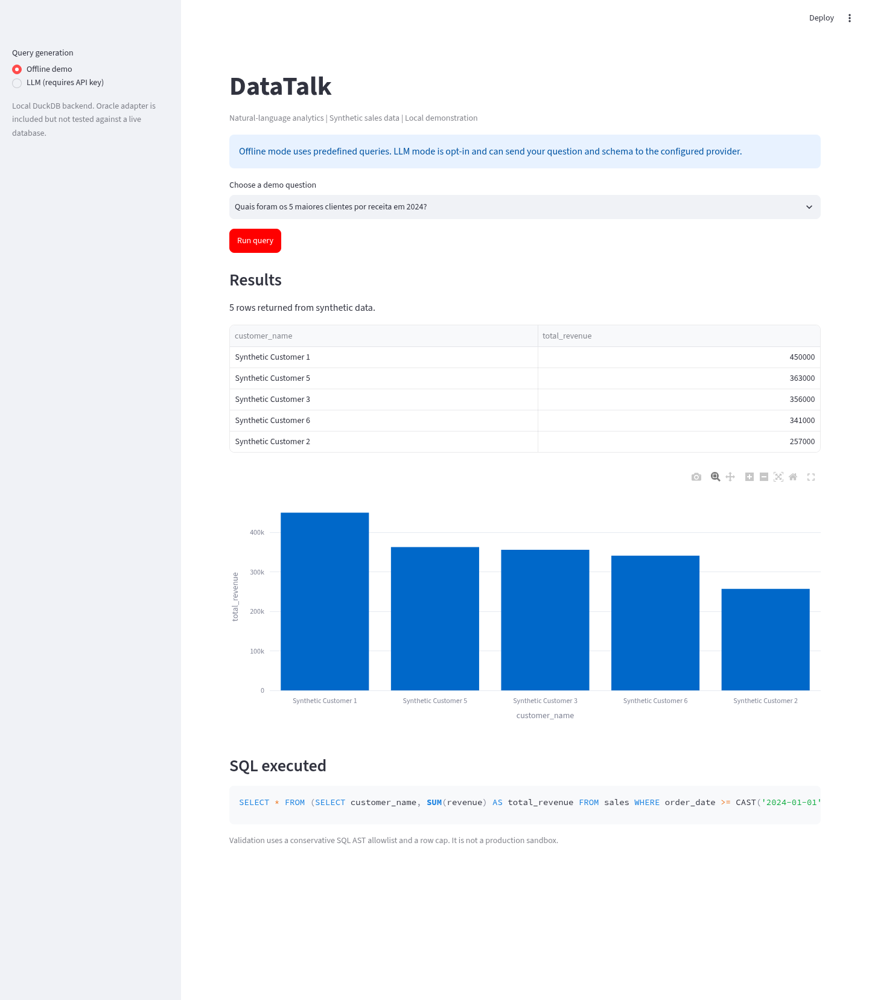
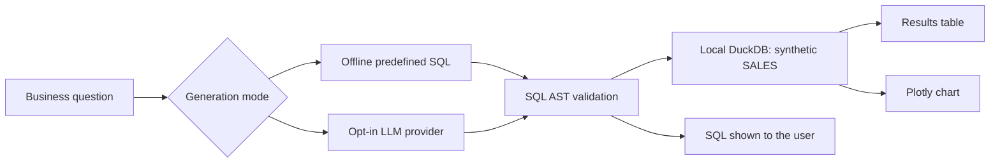

# DataTalk: Enterprise NL2SQL Assistant

Turn a business question into a SQL query, a results table, and a chart. This repository is a local demonstration of the path from natural-language analytics to controlled database access, extracted and simplified from a private enterprise-AI portfolio.

The default demo runs entirely locally on synthetic sales data in DuckDB, with no cloud account or API key. It uses four predefined question-to-SQL mappings, not a general-purpose language model. Optional LLM mode generates SQL through an OpenAI-compatible provider.

## Quick start

Python 3.10+ is required. The draft was tested on Python 3.10.

```bash
python3 -m venv .venv
source .venv/bin/activate
pip install -r requirements-lock.txt
streamlit run app.py --server.address 127.0.0.1
```

Open the local URL printed by Streamlit. Choose **Offline demo**, select a question, and click **Run query**. No `.env` is needed.

Windows: activate with `.venv\Scripts\activate`. `requirements.txt` gives the supported dependency ranges; `requirements-lock.txt` records the tested environment.

## Try these questions

- Quais foram os 5 maiores clientes por receita em 2024?
- Mostre a evolução mensal de receita
- Quais produtos tiveram menor margem média?
- Compare receita e volume por cliente

Offline mode supports exactly these four questions. It rejects unknown questions rather than returning an unrelated default query. The third question ranks mean margin amounts, not margin percentages.



## Architecture



The generation, validation, data, and visualization layers are separate. A small Oracle adapter is retained for integration work, but the UI uses DuckDB only and the Oracle path was not tested against a live database. It is not presented as a working cloud deployment.

## Optional LLM mode

```bash
cp .env.example .env
```

Set `OPENAI_API_KEY`, `MODEL_NAME`, and optionally `LLM_BASE_URL` for your provider. `GEMINI_API_KEY` is accepted as an alternative key variable when using a compatible endpoint. The demo includes no account-specific endpoints or credentials.

Then choose **LLM (requires API key)** in the sidebar. Unlike offline mode, this can incur provider charges and sends the question and schema to that provider. The app does not make an LLM call until you opt in and click **Run query**. Do not put customer data or secrets in questions. Check your provider's data-handling terms before use.

Generated SQL goes through the same validator and local backend as offline SQL. No remote LLM call was made during draft testing. Do not assume an answer is correct merely because the query parses or a chart appears.

## Synthetic data

`src/db/mock_client.py` contains 28 fictional sales rows over 2024-2025. Customer identifiers are explicitly synthetic. Data includes dates, product categories, revenue, volume, cost, margin amounts, and geography. It does not represent customer, company, or personal records. The names and amounts are for demonstration only.

## Controls and limitations

- A SQLGlot AST parser accepts one `SELECT`, allowlisted physical tables, and a conservative set of functions.
- DDL, DML, multiple statements, qualified tables, table functions, and unknown tables are rejected in the tested cases.
- Results are wrapped with a fixed outer row cap, even when generated SQL requests more rows.
- DuckDB external access is disabled after the in-memory synthetic table is created.
- The executed SQL is visible for inspection.

These controls are a demonstration, not a production sandbox or a guarantee against every SQL exploit. A row cap limits output size, not execution cost. The app has no query timeout, tenant isolation, production authentication, authorization, or calibrated answer-quality evaluation. Bind to localhost; do not expose it as a public service. A real deployment needs least-privilege database users, read-only views, timeouts, privacy controls, tenant boundaries, observability, and adversarial evaluation.

The retained Oracle adapter is limited to an unqualified `SALES` table and requires your own local credentials/wallet. No wallet or credential is distributed. Select AI and ERP-specific scenarios from the private app are outside this public-draft scope.

## Tests

```bash
pip install -r requirements-dev.txt
python -m pytest -q
```

Tests cover the four offline questions, charts, row caps, table access, CTEs, unsupported questions, destructive SQL, multiple statements, file/table-function attempts, and DuckDB external-access restrictions. These are regression checks, not a full penetration test. See `docs/verification.md` for the tested scope.

## Repository layout

```text
app.py                         Streamlit demo
src/demo.py                    Offline question-to-SQL mappings
src/sql/validator.py           AST validation and output cap
src/db/mock_client.py          Synthetic data and DuckDB
src/db/oracle_client.py        Optional Oracle integration adapter
src/llm/client.py              Opt-in remote SQL generation
src/schema/metadata.py         Schema context
src/visualization/             Chart selection
tests/                        Regression tests
docs/                         Verification and release notes
```

## What changed from the private application

This is a curated extraction, not a copy of its deployment configuration. It retains the mock data client, schema types, chart builder, and Oracle adapter, while simplifying the UI and generation flow. Regex SQL validation was replaced with conservative AST validation. Personal telemetry, messaging/webhooks, runtime files, private infrastructure paths, sector-specific scenarios, and live deployment settings were excluded.

The focus is a reproducible analytics case rather than a claim of enterprise production readiness. Future work: larger evaluation datasets, query cost controls, dialect coverage, read-only Oracle integration tests, and quality/cost/latency measurements.

## License

[MIT](LICENSE). Copyright (c) 2026 Hsie I Hsuan.

## Author

Hsie I Hsuan (Toni) - [LinkedIn](https://www.linkedin.com/in/hsieihsuan)
